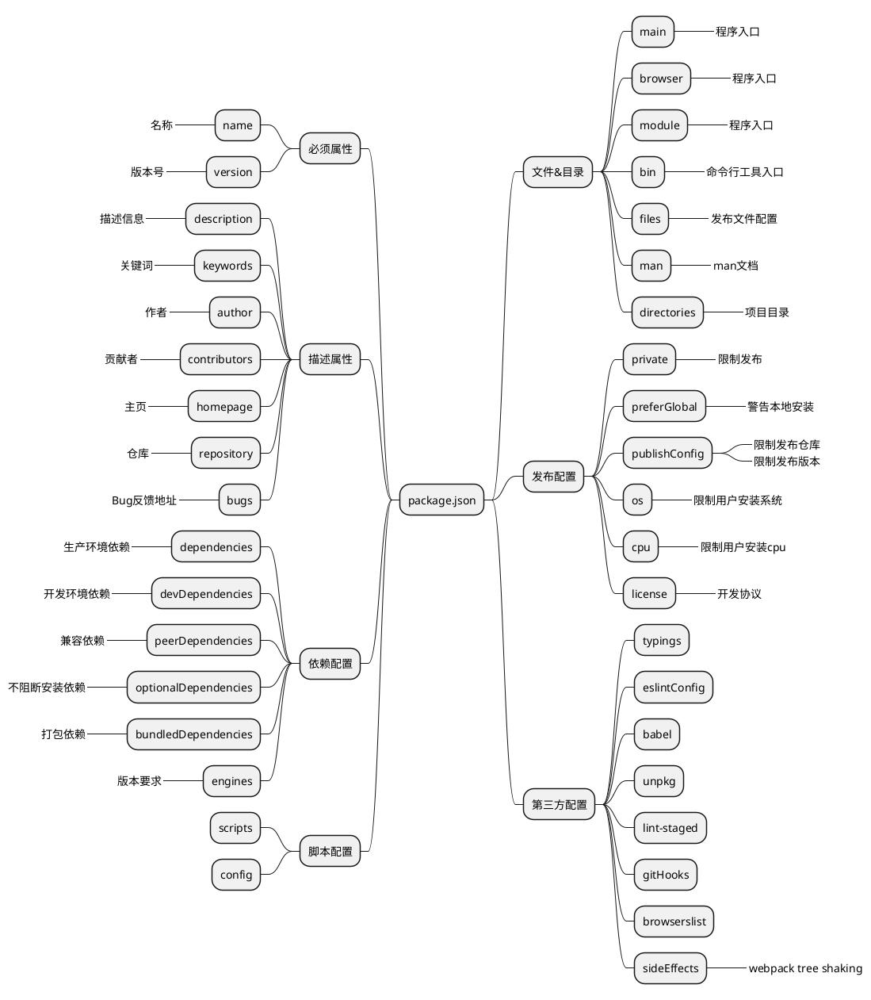

> [ _`npmjs` _](https://docs.npmjs.com/cli/v8/configuring-npm/package-json)



<!-- more -->

<details><summary><b>👋 PlantUML</b></summary>



</details>

---

```bash
 //如果 private 为 true，npm 会拒绝发布。
 "private": true,
 //分别指定生产环境依赖和开发依赖
  "dependencies": {
    "antd": "^2.11.1",
    "classnames": "^2.2.5"
  },
  "devDependencies": {
    "axios": "^0.15.3",
    "babel-eslint": "^6.1.2"
  },
//bin制作命令行工具
  "bin": {
    "dk-cli": "./bin/dk-cli.js"
  },
//script用于配置一些脚本，如npm run start
  "scripts": {
    "start": "node index.js"
  },
//engines记录当前项目依赖 node 和 npm 的版本号
  "engines": {
    "node": ">=6.9.0",
    "npm": ">=3.10.10"
  }
//publishConfig决定了我们发布包发布到哪里去，此时发布包就不是往 www.npmjs.com/ 了
  "publishConfig": {
    "registry": "http://gong/"
  }

```
