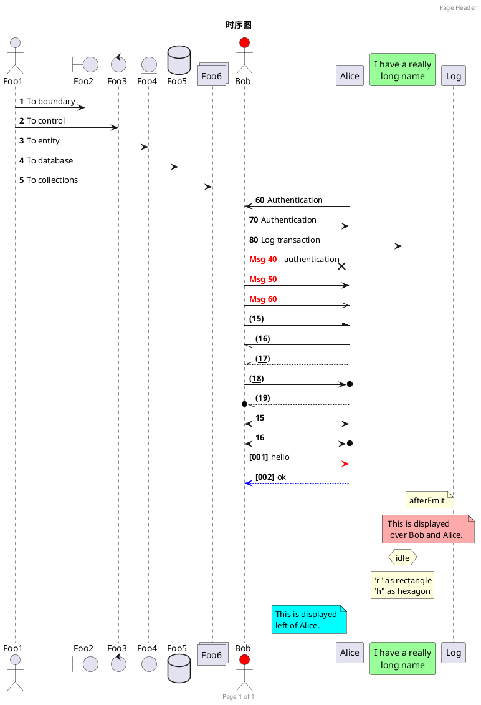

```plantuml

@startuml


header Page Header
footer Page %page% of %lastpage%

title 时序图

autonumber

actor Foo1
boundary Foo2
control Foo3
entity Foo4
database Foo5
collections Foo6

actor Bob #red
' The only difference between actor
'and participant is the drawing
participant Alice
participant "I have a really\nlong name" as L #99FF99
/' You can also declare:
   participant L as "I have a really\nlong name"  #99FF99
  '/
Foo1 -> Foo2 : To boundary
Foo1 -> Foo3 : To control
Foo1 -> Foo4 : To entity
Foo1 -> Foo5 : To database
Foo1 -> Foo6 : To collections

autonumber 60 10

Alice->Bob: Authentication
Bob->Alice: Authentication
Bob->L: Log transaction

autonumber 40 10 "<font color=red><b>Msg 0  "

Bob ->x Alice: authentication
Bob -> Alice
Bob ->> Alice

autonumber 15 "<b>(<u>##</u>)"

Bob -\ Alice
Bob \\- Alice
Bob //-- Alice
Bob ->o Alice
Bob o\\-- Alice

autonumber 15

Bob <-> Alice
Bob <->o Alice

autonumber "<b>[000]"

Bob -[#red]> Alice : hello
Alice -[#0000FF]->Bob : ok

note right of L: afterEmit
note over L, Log #FFAAAA: This is displayed\n over Bob and Alice.
hnote over L : idle
rnote over L
 "r" as rectangle
 "h" as hexagon
endrnote

note left of Alice #aqua
This is displayed
left of Alice.
end note

@enduml

```
